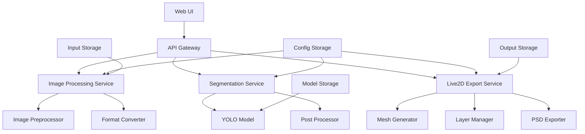

# Seg4Live2D システム設計書

## 概要

Seg4Live2DはYOLOセグメンテーション技術を活用して、イラストを自動的にLive2D用素材として分割するシステムです。

## システムアーキテクチャ

### 全体構成



### コンポーネント設計

#### 1. Web UI Layer
- **技術**: Streamlit
- **責任**: ユーザーインターフェース、ファイルアップロード、プレビュー表示
- **主要機能**:
  - 画像アップロード・プレビュー
  - セグメンテーション設定
  - 結果表示・ダウンロード
  - バッチ処理管理

#### 2. API Gateway
- **技術**: FastAPI (Optional)
- **責任**: リクエストルーティング、認証、レート制限
- **主要機能**:
  - RESTful API エンドポイント
  - リクエスト検証
  - エラーハンドリング

#### 3. Image Processing Service
- **技術**: OpenCV, PIL/Pillow
- **責任**: 画像の前処理・後処理
- **主要機能**:
  - 画像読み込み・形式変換
  - リサイズ・正規化
  - 品質最適化

#### 4. Segmentation Service
- **技術**: YOLOv11 (Ultralytics), PyTorch
- **責任**: 画像セグメンテーション
- **主要機能**:
  - YOLOモデル推論
  - マスク生成・後処理
  - 信頼度スコア計算

#### 5. Live2D Export Service
- **技術**: OpenCV, PIL, PSD-tools
- **責任**: Live2D用素材生成
- **主要機能**:
  - 透明度処理
  - レイヤー分離
  - PSD形式出力
  - メッシュ情報生成

## データフロー

### 1. 画像アップロード→セグメンテーション
```
User Upload → Image Validation → Preprocessing → YOLO Inference → Mask Generation
```

### 2. セグメンテーション→Live2D素材生成
```
Masks → Layer Separation → Transparency Processing → Mesh Generation → PSD Export
```

### 3. バッチ処理フロー
```
Multiple Images → Queue Management → Parallel Processing → Results Aggregation
```

## データ構造

### 1. 画像メタデータ
```python
@dataclass
class ImageMetadata:
    id: str
    filename: str
    width: int
    height: int
    format: str
    upload_time: datetime
    processing_status: ProcessingStatus
```

### 2. セグメンテーション結果
```python
@dataclass
class SegmentationResult:
    image_id: str
    masks: List[np.ndarray]
    classes: List[str]
    confidence_scores: List[float]
    bounding_boxes: List[Tuple[int, int, int, int]]
    processing_time: float
```

### 3. Live2D出力データ
```python
@dataclass
class Live2DOutput:
    image_id: str
    layers: Dict[str, np.ndarray]  # パーツ名 -> 画像データ
    mesh_data: Dict[str, MeshInfo]  # パーツ名 -> メッシュ情報
    psd_path: str
    metadata: Dict[str, Any]
```

## 技術仕様

### 1. 対応画像形式
- **入力**: PNG, JPEG, WebP, TIFF
- **出力**: PNG (透明度対応), PSD (レイヤー構造)

### 2. 画像サイズ制限
- **最大サイズ**: 4096x4096px
- **推奨サイズ**: 1024x1024px ~ 2048x2048px
- **最小サイズ**: 512x512px

### 3. セグメンテーション仕様
- **対象クラス**: 20+ Live2D用パーツ
- **精度目標**: mIoU 0.85+
- **処理時間**: 30秒/枚以内

### 4. Live2D出力仕様
- **レイヤー数**: 最大50層
- **透明度**: フルアルファチャンネル対応
- **メッシュ**: 自動生成 + 手動調整対応

## パフォーマンス要件

### 1. 処理性能
- **単一画像**: 30秒以内
- **バッチ処理**: 10枚並列処理対応
- **メモリ使用量**: 8GB以内（GPU使用時）

### 2. 可用性
- **稼働率**: 99%以上
- **応答時間**: 1秒以内（UI操作）
- **障害復旧**: 5分以内

## セキュリティ設計

### 1. 入力検証
- ファイル形式・サイズ検証
- 悪意あるファイルのスキャン
- アップロード制限（レート制限）

### 2. データ保護
- 一時ファイルの自動削除
- 処理結果の暗号化保存
- ユーザーデータの分離

### 3. アクセス制御
- API認証・認可
- セッション管理
- 監査ログ

## 拡張性設計

### 1. 水平スケーリング
- マイクロサービス化対応
- ロードバランサー対応
- データベース分散

### 2. モデル更新
- A/Bテスト機能
- 段階的デプロイメント
- ロールバック機能

### 3. 機能拡張
- プラグイン方式
- API拡張ポイント
- カスタムモデル対応

## 監視・運用

### 1. メトリクス
- 処理時間・成功率
- リソース使用量
- エラー率・種別

### 2. ログ管理
- 構造化ログ
- ログレベル管理
- 長期保存戦略

### 3. アラート
- 異常検知
- 自動通知
- エスカレーション

## 技術的制約・前提

### 1. ハードウェア要件
- **CPU**: 8コア以上推奨
- **メモリ**: 16GB以上
- **GPU**: NVIDIA GPU (CUDA対応) 推奨
- **ストレージ**: SSD 100GB以上

### 2. ソフトウェア要件
- **OS**: Linux (Ubuntu 20.04+) / Windows 10+
- **Python**: 3.9+
- **CUDA**: 11.8+ (GPU使用時)
- **Docker**: 20.10+ (コンテナ使用時)

### 3. 依存関係
- **PyTorch**: 2.0+
- **Ultralytics**: 8.3.0+ (YOLOv11対応)
- **OpenCV**: 4.8+
- **Streamlit**: 1.28+

## 品質保証

### 1. テスト戦略
- **単体テスト**: 90%以上のカバレッジ
- **統合テスト**: 主要フロー全体
- **E2Eテスト**: ユーザーシナリオベース
- **パフォーマンステスト**: 負荷テスト

### 2. 品質メトリクス
- **セグメンテーション精度**: mIoU 0.85+
- **処理速度**: 30秒/枚以内
- **メモリ効率**: 8GB以内
- **エラー率**: 1%以下

### 3. 継続的改善
- ユーザーフィードバック収集
- モデル性能監視
- 定期的な品質レビュー